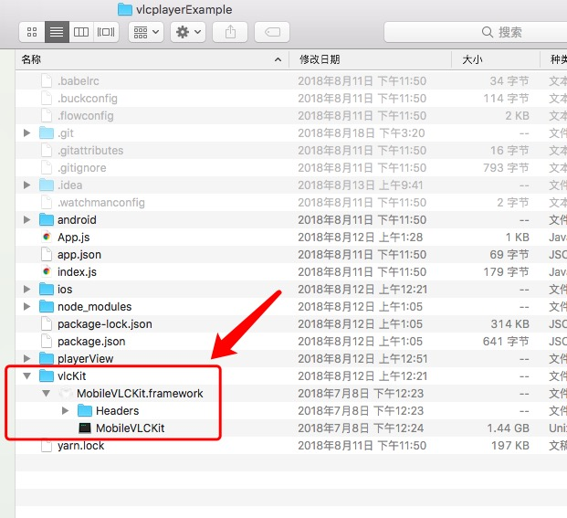
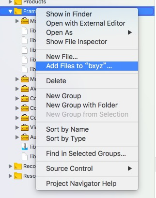
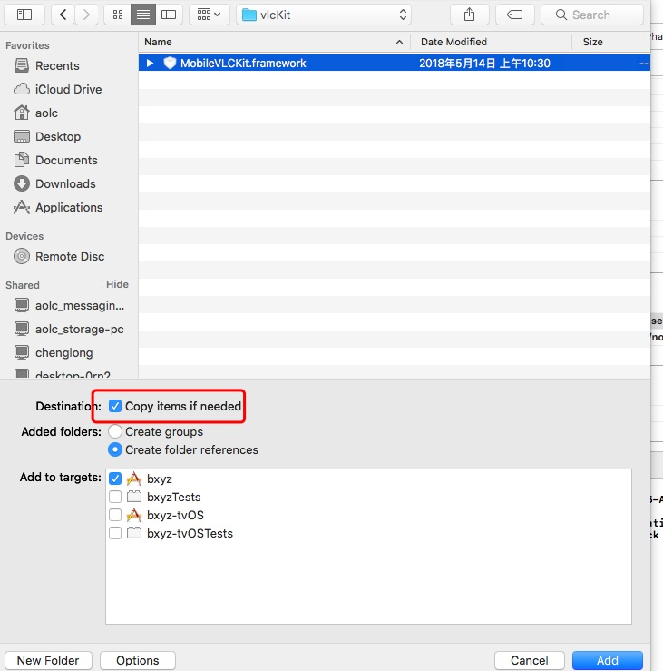
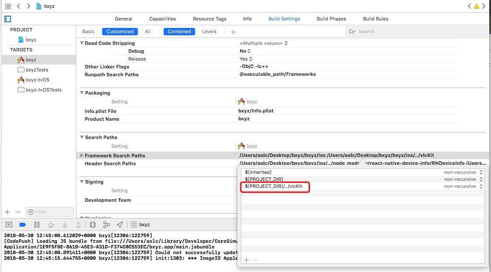
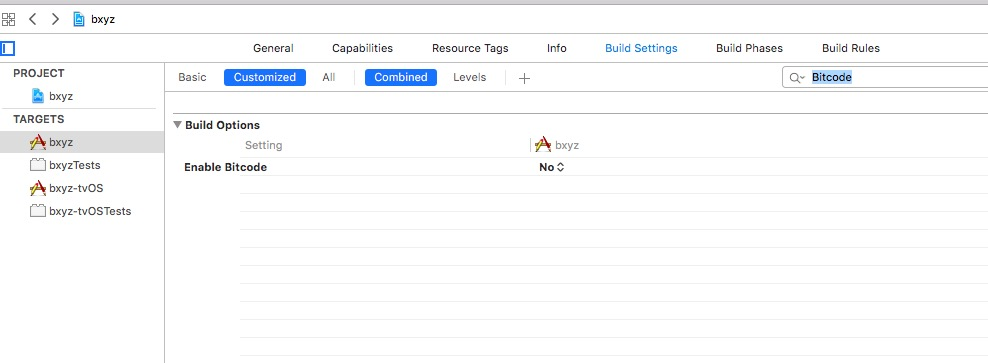

# react-native-yz-vlcplayer

A `<VLCPlayer>` component for react-native  
此项目 参考[react-native-video](https://github.com/react-native-community/react-native-video)，
[react-native-vlcplayer](https://github.com/xiongchuan86/react-native-vlcplayer), 
[react-native-vlc-player](https://github.com/ghondar/react-native-vlc-player)

VLCPlayer 支持各种格式(mp4,m3u8,flv,mov,rtsp,rtmp,etc.)，具体参看[vlc wiki](https://wiki.videolan.org/Documentation:Documentation/)

[https://code.videolan.org/videolan/VLCKit](https://code.videolan.org/videolan/VLCKit)


###  install

     `npm install react-native-yz-vlcplayer --save`


## android setup

android vlc-sdk from:[https://github.com/mengzhidaren/Vlc-sdk-lib](https://github.com/mengzhidaren/Vlc-sdk-lib)

step 1:

Run `react-native link react-native-yz-vlcplayer`


## ios setup

combined from  [react-native-vlcplayer](https://github.com/xiongchuan86/react-native-vlcplayer) 。

reference: [https://code.videolan.org/videolan/VLCKit](https://code.videolan.org/videolan/VLCKit)

step 1: 

   Run `react-native link react-native-yz-vlcplayer`

step 2:
    
   download  MobileVLCKit.framework from  [nightlies.videolan.org/build/iOS/](http://nightlies.videolan.org/build/iOS/)

step 3:

   create a folder named vlcKit, and copy MobileVLCKit.framework in this folder.
   
      
    
step 4:
   
   In XCode, in the project navigator, right click Frameworks -> Add Files to [your project's name], go to `/vlckit` and add MobileVLCKit.framework

   
   
      
   
   
step 5:

   add framework search path:      `$(PROJECT_DIR)/../vlcKit`
   
   
   
    
step 6:

   Select your project. Add the following libraries to your project's Build Phases -> Link Binary With Libraries:

   * AudioToolbox.framework
   * VideoToolbox.framework
   * CoreMedia.framework
   * CoreVideo.framework
   * CoreAudio.framework
   * AVFoundation.framework
   * MediaPlayer.framework
   * libstdc++.6.0.9.tbd
   * libiconv.2.tbd
   * libc++.1.tbd
   * libz.1.tbd
   * libbz2.1.0.tbd

step 7:

   set `Enable Bitcode`  to  `no`
   
   Build Settings ---> search  Bitcode
    
      
   

step 8:

  set project deployment target  `9.3`


## other react-native plugins

   1. npm install react-native-orientation --save
   
      react-native link react-native-orientation
      
   2. npm install react-native-slider --save
   
   3. npm install react-native-vector-icons --save
   
      react-native link react-native-vector-icons
      
      
## Static Methods

`seek(seconds)`

```
android:
    this.vlcplayer.seek(100); //  unit(单位)  ms 
ios:
    this.vlcplayer.seek(0.1); //  0 --- 1 视频位置进度


this.vlcPlayer.resume(autoplay) //重新加载视频进行播放,autopaly: true 表示播放 false表示暂停

this.vlcPlayer.play(bool)       // true: play the video   false: paused the video


this.vlcPlayer.snapshot(path)  // path: string  存储的文件的路径。


```

##  VLCPlayer props
    
    import { VLCPlayer } from 'react-native-yz-vlcplayer';  
    
   | props       | type     |  value  |   describe |
   | --------    | :----:   |  :----:  |   :----:   |
   | paused      | bool     |         |            |
   | muted       | bool     |         |            |
   | volume      | bool     | 0---200 |            |
   | source      | object   | { uri: 'http:...' }| |
   | autoplay    | bool     |       |  是否自动播放（默认true）        |
   | onLoadStart | func     |       |  vlc视频容器初始化完毕  |
   | onOpen      | func     |       |  视频被打开            |
   | onBuffering | func     |       |  正在缓冲中           |
   | onProgress  | func     | { currentTime:1000,duration:1000 }  unit：ms    |  视频进度发生改变     |
   | onEnd       | func     |       |  视频播放结束        |
   | onPlaying   | func     |       |  视频正在播放        |
   | onPaused    | func     |       |  视频暂停           |
   | onError     | func     |       |  播放视频出错       |
   | onIsPlaying | func     | {isPlaying:true}   |  视频是否正在播放       |

   
   
   ```
      onBuffer:   
      
        android: {
                    isPlaying: true,
                    bufferRate: 70,
                    duration: 0,
                 }
                 
            ios: {
                   duration: 0,
                   isPlaying: true,
                 }
                 
      onProgress:
            
                {
                    currentTime: 1000        ms
                    duration: 5000           ms
                }
                
      onIsPlaying:
                
                {
                    isPlaying: true
                }
   
   ```
   

## 回调函数简单说明（目前碰到的）
 ```       
                                                             支持平台                
           onEnd            视频播放结束                  ios       android
           onBuffering      正在缓冲中                    ios       android
           onError          播放视频出错                  
           onPlaying        视频播放                      ios       android
           onPaused         视频暂停                      ios       android
           onOpen           视频被打开                              android
           onLoadStart      vlc视频容器初始化完毕          ios       android
           onProgress       视频进度发生改变               ios       android          swf格式不支持
           
           回调函数出现顺序:  onLoadStart  ---> onOpen 
          
 ```


##  use plugin
````
   import { VLCPlayer, VlCPlayerView } from 'react-native-yz-vlcplayer';
   import Orientation from 'react-native-orientation';
   
   (1) 
       android:
           this.vlcplayer.seek(100); // 单位是 ms 
       ios:
           this.vlcplayer.seek(0.1); // 0 --- 1 视频位置进度
  （2）
       <VLCPlayer
           ref={ref => (this.vlcPlayer = ref)}
           style={[styles.video]}
           /**
            *  增加视频宽高比，视频将按照这个比率拉伸
            *  不设置按照默认比例
            */
           videoAspectRatio="16:9"  
           /**
            *  是否暂停播放
            */
           paused={this.state.paused}
           /**
            *  资源路径
            *  暂不支持本地资源
            */
           source={{ uri: this.props.uri}}
           /**
            *  进度   
            *  返回 {currentTime:1000,duration:1000} 
            *  单位是 ms
            *  currentTime: 当前时间  
            *  duration:    总时间  
            */
           onProgress={this.onProgress.bind(this)}
           /**
            *  视频播放结束
            */
           onEnd={this.onEnded.bind(this)}
           /**
            * 正在缓存中
            */
           onBuffering={this.onBuffering.bind(this)}
           /**
            * 播放视频出错
            */
           onError={this._onError}
           /**
            * 视频停止
            */
           onStopped={this.onStopped.bind(this)}   
           /**
            * 视频播放
            */
           onPlaying={this.onPlaying.bind(this)}   
           /**
            * 视频暂停
            */
           onPaused={this.onPaused.bind(this)}  
           /**
            * 视频被打开
            /
           onOpen={this._onOpen}
           /**
            * vlc视频容器初始化完毕
            * 在这里进行设置播放的进度，是否开始播放
            */
           onLoadStart={()=>{
                   if(Platform.OS === 'ios'){
                       this.vlcPlayer.seek(0); //设置播放进度
                   }else{
                       this.vlcPlayer.seek(0); //设置播放的时间
                   }
                   this.setState({
                     paused: true,
                   },()=>{
                     this.setState({
                       paused: false,
                     });
                   })
           }}
       />
  
````

   
## example project 
     
   [https://github.com/xuyuanzhou/vlcplayerExample](https://github.com/xuyuanzhou/vlcplayerExample)


## Simple Example

````
   import { VLCPlayer, VlCPlayerView, VlCPlayerViewByMethod } from 'react-native-yz-vlcplayer';
   import Orientation from 'react-native-orientation';

   (1)  <VlCPlayerView
           url={this.state.url}           //视频url 
           Orientation={Orientation}      
           //BackHandle={BackHandle}
           AdUrl=""                      // 广告url
           showAd={false}                // 是否显示广告
           showTitle={true}              // 是否显示标题
           title=""                      // 标题
           showBack={true}               // 是否显示返回按钮
           onLeftPress={()=>{}}          // 返回按钮点击事件
           startFullScreen={() => {      
              this.setState({
              isFull: true,
             });
           }}
           closeFullScreen={() => {
              this.setState({
              isFull: false,
             });
           }}
       />
    
    
   (2)
       
       use  `this.vlcPlayer.play(bool)`   instead of  parameter  `paused`
       
            <VlCPlayerViewByMethod
               ref={ ref => this.vlCPlayerView = ref}
               onVipPress={this._onVipPress.bind(this)}
               autoPlay={true}
               url={"rtmp://live.hkstv.hk.lxdns.com/live/hks"}
               onLeftPress={() => {
               }}
               onProgressChange={this._onProgressChange}
               //title={title}              
               //showTitle={true}
               //showBack={true}
               //lookTime={timeStudied}
               //totalTime={timeTotal}
               //useVip={!hadOwn}
               onEnd={this._onEnd}
               Orientation={Orientation}
               BackHandle={BackHandle}
               //autoPlayNext={false}
               //autoRePlay={false}
               //hadNext={false}
               showAd={true}
               adUrl="http://bxyzweb.doctorz.cn/ofafilm/03.swf"             
               //chapterElements={this._renderList()}
               onStartFullScreen={() => {
                 this.setState({
                   isFull: true,
                 });
               }}
               onCloseFullScreen={() => {
                 this.setState({
                   isFull: false,
                 });
               }}
            />
        
````

**MIT Licensed**
